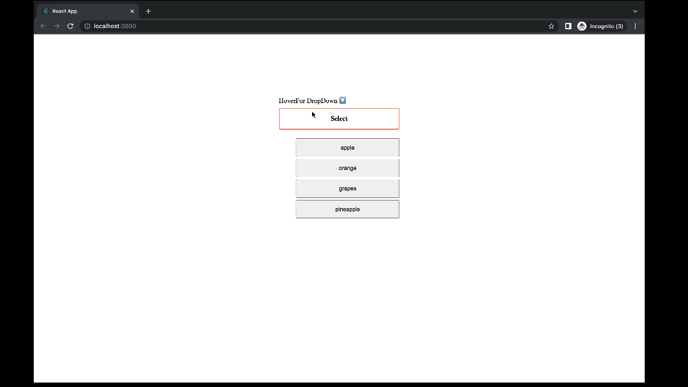

# Dropdown on Hover

[Deployment_link](https://nishant-l.github.io/Hover-button/)

a simple dropdown component using React.

- On hovering of the button, show the drop down items.
- The dropdown component receive the items array to display the items in the list.
- On click of an option in dropdown list, closes the dropdown and display the selected item.

# Setting Up this React App

## Available Scripts

In the project directory, you can run:

### `npm start`

Runs the app in the development mode.\
Open [http://localhost:3000](http://localhost:3000) to view it in your browser.

The page will reload when you make changes.\
You may also see any lint errors in the console.

